# **minishell**

In this project the idea is dive a little deeper inside the linux world creating a simplified shell, a command line user interface, to interact with operating system.

## Mandatory

To achieve the goal the minishell must: (from minishell subject version 6)

- Not interpret unclosed quotes or unspecified special characters like **\\** or **;**.
- Not use more than one global variable, think about it and be ready to explain why you do it.
- Show a prompt when waiting for a new command.
- Have a working History.
- Search and launch the right executable (based on the PATH variable or by using relative or absolute path)
- It must implement the builtins:
	- **echo** with option -n
	- **cd** with only a relative or absolute path
	- **pwd** with no options
	- **export** with no options
	- **unset** with no options
	- **env** with no options or arguments
	- **exit** with no options
- **'** inhibit all interpretation of a sequence of characters.
- **"** inhibit all interpretation of a sequence of characters except for $.
- Redirections:
	- **<** should redirect input.
	- **>** should redirect output.
	- **<<** read input from the current source until a line containing only the delimiter is seen. it doesn’t need to update history!
	- **>>** should redirect output with append mode.
- Pipes **|** The output of each command in the pipeline is connected via a pipe to the input of the next command.
- Environment variables (**\$** followed by characters) should expand to their values.
- **$?** should expand to the exit status of the most recently executed foreground
pipeline.
- **ctrl-C** **ctrl-D** **ctrl-\\** should work like in bash.
- When interactive:
	- **ctrl-C** print a new prompt on a newline.
	- **ctrl-D** exit the shell.
	- **ctrl-\\** do nothing.

*obs.: **readline** function can produce some leak you don’t need to fix this.*

## Bonus

To achieve the bonus the minishell must: (from minishell subject version 6)

- **&&**, **||** with parenthesis for priorities.
- the wildcard *\** should work for the current working directory.


## External Allowed Functions

| function | description | header |
|----------|-------------|--------|
| readline | get a line from a user with editing | stdio.h <br> readline/readline.h <br> readline/history.h |
| rl_clear_history | clear the history list by deleting all of the entries |stdio.h <br> readline/readline.h <br> readline/history.h |
| rl_on_new_line | tell the update functions that we have moved onto a new (empty) line | stdio.h <br> readline/readline.h <br> readline/history.h |
| rl_replace_line | replace the contents of rl_line_buffer with text | stdio.h <br> readline/readline.h <br> readline/history.h |
| rl_redisplay | if non-zero, Readline will call indirectly through this pointer to update the display with the current contents of the editing buffer | stdio.h <br> readline/readline.h <br> readline/history.h |
| add_history | Place string at the end of the history list | stdio.h <br> readline/readline.h <br> readline/history.h |
| printf | format and print data | stdlib.h |
| malloc | allocate dynamic memory | stdlib.h |
| free | free dynamic memory | stdlib.h |
| write | write to a file descriptor | unistd.h |
| access | check user's permissions for a file | unistd.h |
| open | open and possibly create a file | fcntl.h |
| read | read from a file descriptor | unistd.h |
| close | close a file descriptor | unistd.h |
| fork | create a child process | sys/types.h <br> unistd.h |
| wait <br> waitpid | wait for process to change state | sys/types.h <br> sys/wait.h |
| wait3 <br> wait4 | wait for process to change state, BSD style | sys/types.h <br> sys/time.h <br> sys/resource.h <br> sys/wait.h |
| signal | ANSI C signal handling | signal.h |
| sigaction | examine and change a signal action | signal.h |
| kill | send a signal to a process | signal.h |
| exit | cause normal process termination | stdlib.h |
| getcwd | get current working directory | unistd.h |
| chdir | change working directory | unistd.h |
| stat <br> lstat | get file status | sys/types.h <br> sys/stat.h  <br> unistd.h |
| get file status | fstat | get file status | sys/types.h <br> sys/stat.h  <br> unistd.h |
| unlink | call the unlink function to remove the specified file | unistd.h |
| execve | execute program | unistd.h |
| dup <br> dup2 | duplicate a file descriptor | unistd.h |
| pipe | create pipe | unistd.h |
| opendir | open a directory | sys/types.h <br> dirent.h |
| readdir | read a directory | dirent.h |
| closedir | close a directory | sys/types.h <br> dirent.h |
| strerror | return string describing error number | string.h |
| perror | print a system error message | stdio.h |
| isatty | test whether a file descriptor refers to a terminal | unistd.h |
| ttyname | return name of a terminal | unistd.h |
| ttyslot | find the slot of the current user's terminal in some file | unistd.h |
| ioctl | control device | sys/ioctl.h |
| getenv | get an environment variable | stdlib.h |
| tcsetattr | set the parameters associated with the terminal | termios.h |
| tcgetattr | get the parameters associated with the terminal | termios.h |
| tgetent <br> tgetflag <br> tgetnum <br> tgetstr <br> tgoto <br> tputs | curses emulation of termcap | curses.h <br> term.h |


# Project Development

## Overview

Following some tips from prof. Gustavo Rodrigues[^grr], to build this project we need to implement a **Lexer**, **Parser** and **Executor**.

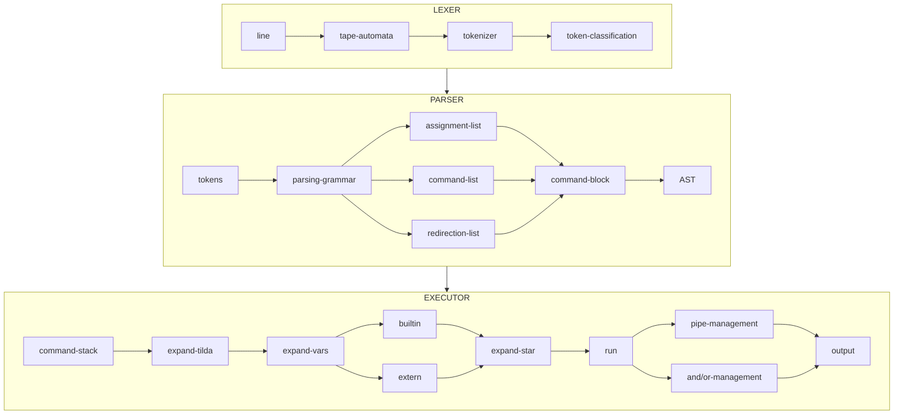

The **Lexer** will be responsible to separate the line in tokens and classifies it in some categories as: word (that will represent commands, arguments, filenames and var names), assignments (strings with a equals "=" sign inside), pipe (for the "|" pipe symbol), and (for "&&" symbol) and or (for the "||" symbol).

The **Parser** will acept or not the line, in this project we only need to manage only one line per time, additionally this entity will be responsible by separate the tokens in lists of assignmets, a list of commands and args and a list of redirections, putting this blocks in an AST (Abstract Syntax Tree)

Example of an AST
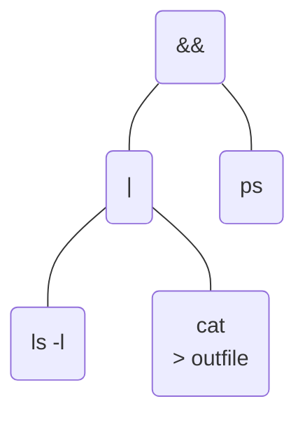

The **Executor**, this entity will do the hard work, where it will expand the variables , tilt and star, take the AST and construct a command stack, make the local and global variables lists, open the files to read and/or write to redirects use, execute builtins and extern commands, manage pipes and and/or tokens.

##  The LEXER

This entity must separate the tokens from th line, whe can follow the way showed by Ricardo Hincapie[^richi], but we choose the path similar to that adopted by compiler developers, where we build a automata to split tokens, deveop a grammar to parse the line, this can be this can be seen in the  Alfred V. Aho book[^alfvaho], a tape automata is a easier way to separate the tokens like ">outfile" where the symbol ">" is binded to the "filename".

## Tokens description

|TOKEN | REGEX | TOKEN TYPE !
|------|-------------|----------|
| \| | [ \| ]\{1\} | pipe |
| \( | [ \( ]\{1\} | lbrace |
| \) | [ \) ]\{1\}  | rbrace |
| && | [ & ]\{2\} | and_if |
| \|\| | [ \| ]\{2\} | or_if |
| \< | [ \< ]\{1\} | less |
| \> | [ \> ]\{1\} | great |
| \<\< | [ \< ]\{2\} | dless |
| \<\> | [ \< ]\{1\} [ \> ]\{1\} | lessgreat |
| \>\> | [ \> ]\{2\} | dgreat |
| ASSIGNMENT | [A-Za-z_] [0-9A-Za-z_]\* = ( ([ ' ] ( [ \$ ]? [0-9A-Za-z_]\* ) [ ' ] ) \| ( [ " ] [ \$ ]? [0-9A-Za-z_]\* [ " ] ) \| ( [ $ ]? [0-9A-Za-z_]\* ) )? | assignment |
| WORD | ( [ ' ] [ \$ ]? [0-9A-Za-z_]+ [ ' ] ) \| ( [ " ] [ \$ ]? [0-9A-Za-z_]+ [ " ] ) \| (  [ \$ ]? [0-9A-Za-z_]+ ) | word |
| NULL | NULL | tok_eof |

##  The PARSER

### Minishell context free grammar

```
START ==> AND_OR
AND_OR ==> PIPELINE | AND_OR and_if PIPELINE | AND_OR or_if PIPELINE
PIPELINE ==> COMMAND | COMMAND pipe PIPELINE
COMMAND ==> SIMPLE_CMD | SUBSHELL | SUBSHELL REDIRECT_LIST
SUBSHELL ==> lbrace AND_OR rbrace
SIMPLE_CMD ==> word | word CMD_SULFIX | CMD_PREFIX | CMD_PREFIX word | CMD_PREFIX word CMD_SULFIX
CMD_PREFIX ==> IO_REDIRECT | CMD_PREFIX IO_REDIRECT | assignment | CMD_PREFIX assignment
CMD_SULFIX ==> IO_REDIRECT | CMD_SULFIX IO_REDIRECT | word | CMD_SULFIX word
REDIRECT_LIST ==> IO_REDIRECT | REDIRECT_LIST IO_REDIRECT
IO_REDIRECT ==> IO_FILE | IO_HERE
IO_FILE ==> less word
IO_FILE ==> great word
IO_FILE ==> dgreat word
IO_FILE ==> lessgreat word
IO_HERE ==> dless word
```
### State diagram of CFG
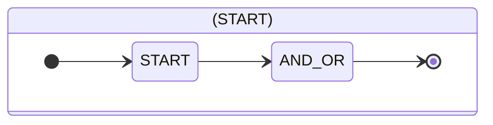
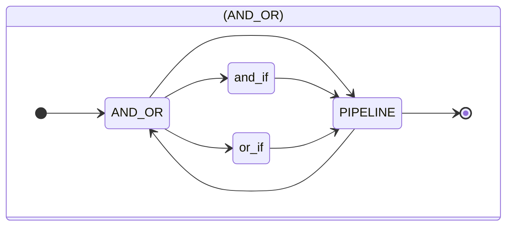
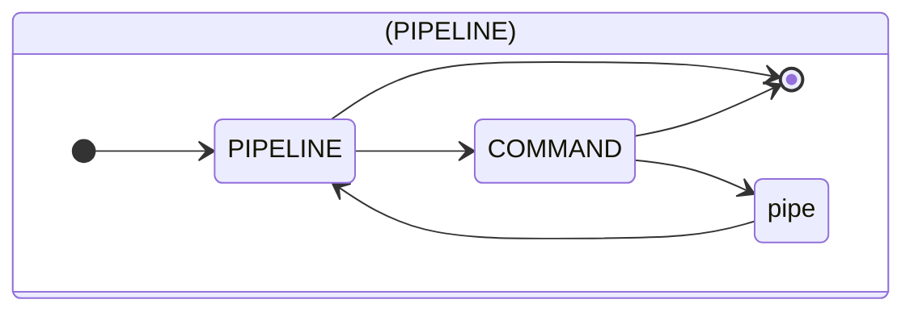
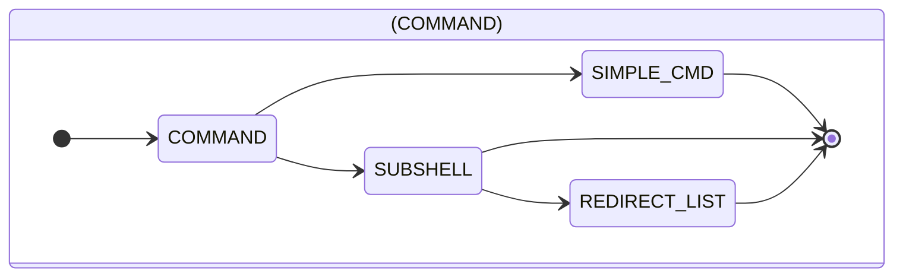
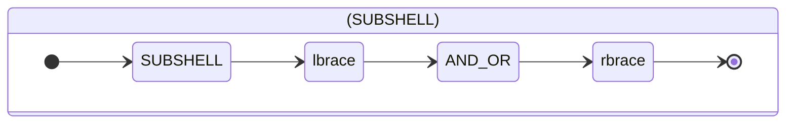
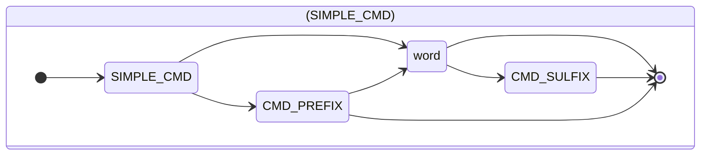
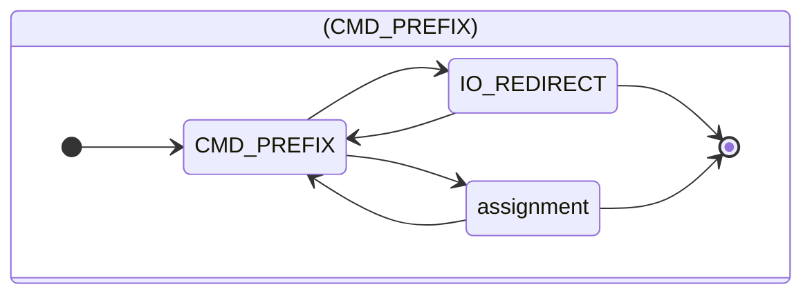
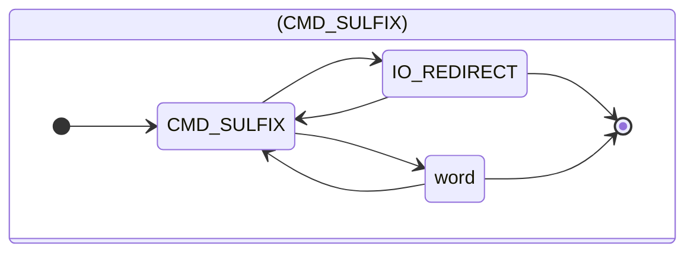
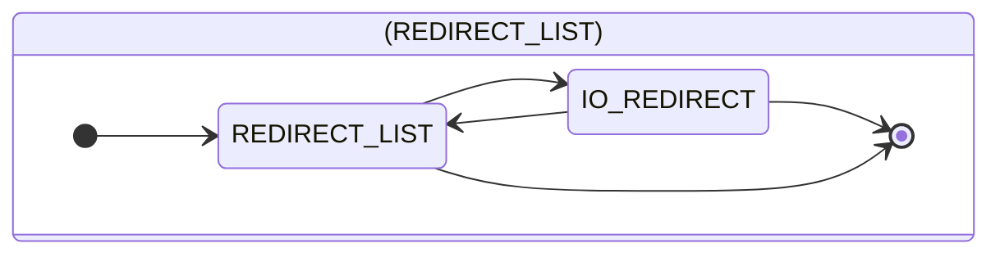
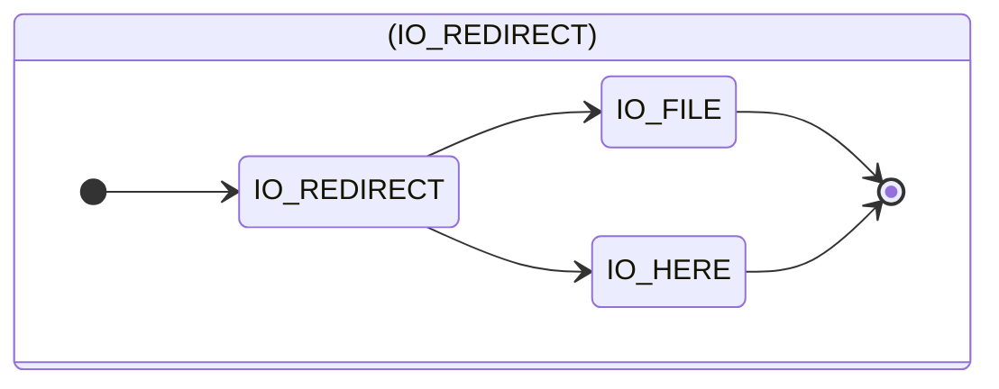
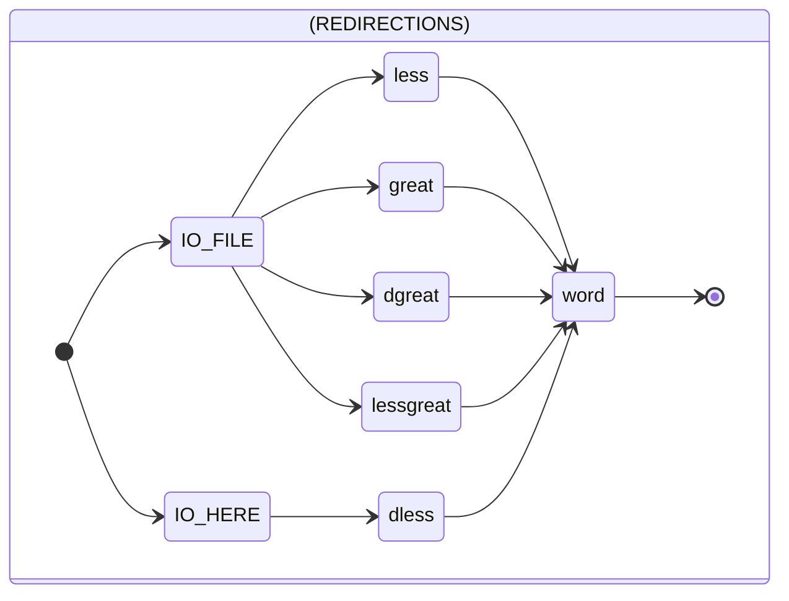
### **Shell Context Free Grammar (CFG) grammar, LL(1) type, defined with the BNF syntax:**

```
START ::= AND_OR
AND_OR ::= PIPELINE AND_OR1
AND_OR1 ::= ''
AND_OR1 ::= and_if AND_OR
AND_OR1 ::= or_if AND_OR
PIPELINE ::= COMMAND PIPELINE1
PIPELINE1 ::= ''
PIPELINE1 ::= pipe PIPELINE
COMMAND ::= SIMPLE_CMD
COMMAND ::= SUBSHELL COMMAND1
COMMAND1 ::= ''
COMMAND1 ::= REDIRECT_LIST
SUBSHELL ::= lbrace AND_OR rbrace
SIMPLE_CMD ::= CMD_PREFIX SIMPLE_CMD1
SIMPLE_CMD ::= word SIMPLE_CMD2
SIMPLE_CMD1 ::= ''
SIMPLE_CMD1 ::= word SIMPLE_CMD2
SIMPLE_CMD2 ::= ''
SIMPLE_CMD2 ::= CMD_SULFIX
CMD_PREFIX ::= IO_REDIRECT CMD_PREFIX1
CMD_PREFIX ::= assignment CMD_PREFIX1
CMD_PREFIX1 ::= ''
CMD_PREFIX1 ::= CMD_PREFIX
CMD_SULFIX ::= IO_REDIRECT CMD_SULFIX1
CMD_SULFIX ::= word CMD_SULFIX1
CMD_SULFIX1 ::= ''
CMD_SULFIX1 ::= CMD_SULFIX
REDIRECT_LIST ::= IO_REDIRECT REDIRECT_LIST1
REDIRECT_LIST1 ::= ''
REDIRECT_LIST1 ::= REDIRECT_LIST
IO_REDIRECT ::= IO_FILE
IO_REDIRECT ::= IO_HERE
IO_FILE ::= less word
IO_FILE ::= great word
IO_FILE ::= dgreat word
IO_FILE ::= lessgreat word
IO_HERE ::= dless word
```

### **Nullable/First/Follow Table**

| Nonterminal | Nullable? | First | Follow |
| :-- | --- | --- | --- |
| S | ✖ | word, lbrace, assignment, less, great, dgreat, lessgreat, dless |  |
| START | ✖ | word, lbrace, assignment, less, great, dgreat, lessgreat, dless | $ |
| AND_OR | ✖ | word, lbrace, assignment, less, great, dgreat, lessgreat, dless | rbrace, $ |
| AND_OR1 | ✔ | and_if, or_if | rbrace, $ |
| PIPELINE | ✖ | word, lbrace, assignment, less, great, dgreat, lessgreat, dless | and_if, or_if, rbrace, $ |
| PIPELINE1 | ✔ | pipe | and_if, or_if, rbrace, $ |
| COMMAND | ✖ | word, lbrace, assignment, less, great, dgreat, lessgreat, dless | and_if, or_if, pipe, rbrace, $ |
| COMMAND1 | ✔ | less, great, dgreat, lessgreat, dless | and_if, or_if, pipe, rbrace, $ |
| SUBSHELL | ✖ | lbrace | and_if, or_if, pipe, less, great, dgreat, lessgreat, dless, rbrace, $ |
| SIMPLE_CMD | ✖ | word, assignment, less, great, dgreat, lessgreat, dless | and_if, or_if, pipe, rbrace, $ |
| SIMPLE_CMD1 | ✔ | word | and_if, or_if, pipe, rbrace, $ |
| SIMPLE_CMD2 | ✔ | word, less, great, dgreat, lessgreat, dless | and_if, or_if, pipe, rbrace, $ |
| CMD_PREFIX | ✖ | assignment, less, great, dgreat, lessgreat, dless | and_if, or_if, pipe, word, rbrace, $ |
| CMD_PREFIX1 | ✔ | assignment, less, great, dgreat, lessgreat, dless | and_if, or_if, pipe, word, rbrace, $ |
| CMD_SULFIX | ✖ | word, less, great, dgreat, lessgreat, dless | and_if, or_if, pipe, rbrace, $ |
| CMD_SULFIX1 | ✔ | word, less, great, dgreat, lessgreat, dless | and_if, or_if, pipe, rbrace, $ |
| REDIRECT_LIST | ✖ | less, great, dgreat, lessgreat, dless | and_if, or_if, pipe, rbrace, $ |
| REDIRECT_LIST1 | ✔ | less, great, dgreat, lessgreat, dless | and_if, or_if, pipe, rbrace, $ |
| IO_REDIRECT | ✖ | less, great, dgreat, lessgreat, dless | and_if, or_if, pipe, word, assignment, less, great, dgreat, lessgreat, dless, rbrace, $ |
| IO_FILE | ✖ | less, great, dgreat, lessgreat | and_if, or_if, pipe, word, assignment, less, great, dgreat, lessgreat, dless, rbrace, $ |
| IO_HERE | ✖ | dless | and_if, or_if, pipe, word, assignment, less, great, dgreat, lessgreat, dless, rbrace, $ |

### **Transition Table**

| | $ | and_if | or_if | pipe | lbrace | rbrace | assign_word | less | great | dgreat | lessgreat | dless | word |
| --- | --- | --- | --- | --- | --- | --- | --- | --- | --- | --- | --- | --- | --- |
| S |  |  |  |  | S ::= START $ |  | S ::= START $ | S ::= START $ | S ::= START $ | S ::= START $ | S ::= START $ | S ::= START $ | S ::= START $ |
| START |  |  |  |  | START ::= AND_OR |  | START ::= AND_OR | START ::= AND_OR | START ::= AND_OR | START ::= AND_OR | START ::= AND_OR | START ::= AND_OR | START ::= AND_OR |
| AND_OR |  |  |  |  | AND_OR ::= PIPELINE AND_OR1 |  | AND_OR ::= PIPELINE AND_OR1 | AND_OR ::= PIPELINE AND_OR1 | AND_OR ::= PIPELINE AND_OR1 | AND_OR ::= PIPELINE AND_OR1 | AND_OR ::= PIPELINE AND_OR1 | AND_OR ::= PIPELINE AND_OR1 | AND_OR ::= PIPELINE AND_OR1 |
| AND_OR1 | AND_OR1 ::= ε | AND_OR1 ::= and_if AND_OR | AND_OR1 ::= or_if AND_OR |  |  | AND_OR1 ::= ε |  |  |  |  |  |  |  |
| PIPELINE |  |  |  |  | PIPELINE ::= COMMAND PIPELINE1 |  | PIPELINE ::= COMMAND PIPELINE1 | PIPELINE ::= COMMAND PIPELINE1 | PIPELINE ::= COMMAND PIPELINE1 | PIPELINE ::= COMMAND PIPELINE1 | PIPELINE ::= COMMAND PIPELINE1 | PIPELINE ::= COMMAND PIPELINE1 | PIPELINE ::= COMMAND PIPELINE1 |
| PIPELINE1 | PIPELINE1 ::= ε | PIPELINE1 ::= ε | PIPELINE1 ::= ε | PIPELINE1 ::= pipe PIPELINE |  | PIPELINE1 ::= ε |  |  |  |  |  |  |  |
| COMMAND |  |  |  |  | COMMAND ::= SUBSHELL COMMAND1 |  | COMMAND ::= SIMPLE_CMD | COMMAND ::= SIMPLE_CMD | COMMAND ::= SIMPLE_CMD | COMMAND ::= SIMPLE_CMD | COMMAND ::= SIMPLE_CMD | COMMAND ::= SIMPLE_CMD | COMMAND ::= SIMPLE_CMD |
| COMMAND1 | COMMAND1 ::= ε | COMMAND1 ::= ε | COMMAND1 ::= ε | COMMAND1 ::= ε |  | COMMAND1 ::= ε |  |  | COMMAND1 ::= REDIRECT_LIST | COMMAND1 ::= REDIRECT_LIST | COMMAND1 ::= REDIRECT_LIST | COMMAND1 ::= REDIRECT_LIST | COMMAND1 ::= REDIRECT_LIST |
| SUBSHELL |  |  |  |  | SUBSHELL ::= lbrace AND_OR rbrace |  |  |  |  |  |  |  |  |
| SIMPLE_CMD |  |  |  |  |  |  | SIMPLE_CMD ::= word SIMPLE_CMD2 | SIMPLE_CMD ::= CMD_PREFIX SIMPLE_CMD1 | SIMPLE_CMD ::= CMD_PREFIX SIMPLE_CMD1 | SIMPLE_CMD ::= CMD_PREFIX SIMPLE_CMD1 | SIMPLE_CMD ::= CMD_PREFIX SIMPLE_CMD1 | SIMPLE_CMD ::= CMD_PREFIX SIMPLE_CMD1 | SIMPLE_CMD ::= CMD_PREFIX SIMPLE_CMD1 |
| SIMPLE_CMD1 | SIMPLE_CMD1 ::= ε | SIMPLE_CMD1 ::= ε | SIMPLE_CMD1 ::= ε | SIMPLE_CMD1 ::= ε |  | SIMPLE_CMD1 ::= ε | SIMPLE_CMD1 ::= word SIMPLE_CMD2 |  |  |  |  |  |  |
| SIMPLE_CMD2 | SIMPLE_CMD2 ::= ε | SIMPLE_CMD2 ::= ε | SIMPLE_CMD2 ::= ε | SIMPLE_CMD2 ::= ε |  | SIMPLE_CMD2 ::= ε | SIMPLE_CMD2 ::= CMD_SULFIX |  | SIMPLE_CMD2 ::= CMD_SULFIX | SIMPLE_CMD2 ::= CMD_SULFIX | SIMPLE_CMD2 ::= CMD_SULFIX | SIMPLE_CMD2 ::= CMD_SULFIX | SIMPLE_CMD2 ::= CMD_SULFIX |
| CMD_PREFIX |  |  |  |  |  |  |  | CMD_PREFIX ::= assignment CMD_PREFIX1 | CMD_PREFIX ::= IO_REDIRECT CMD_PREFIX1 | CMD_PREFIX ::= IO_REDIRECT CMD_PREFIX1 | CMD_PREFIX ::= IO_REDIRECT CMD_PREFIX1 | CMD_PREFIX ::= IO_REDIRECT CMD_PREFIX1 | CMD_PREFIX ::= IO_REDIRECT CMD_PREFIX1 |
| CMD_PREFIX1 | CMD_PREFIX1 ::= ε | CMD_PREFIX1 ::= ε | CMD_PREFIX1 ::= ε | CMD_PREFIX1 ::= ε |  | CMD_PREFIX1 ::= ε | CMD_PREFIX1 ::= ε | CMD_PREFIX1 ::= CMD_PREFIX | CMD_PREFIX1 ::= CMD_PREFIX | CMD_PREFIX1 ::= CMD_PREFIX | CMD_PREFIX1 ::= CMD_PREFIX | CMD_PREFIX1 ::= CMD_PREFIX | CMD_PREFIX1 ::= CMD_PREFIX |
| CMD_SULFIX |  |  |  |  |  |  | CMD_SULFIX ::= word CMD_SULFIX1 |  | CMD_SULFIX ::= IO_REDIRECT CMD_SULFIX1 | CMD_SULFIX ::= IO_REDIRECT CMD_SULFIX1 | CMD_SULFIX ::= IO_REDIRECT CMD_SULFIX1 | CMD_SULFIX ::= IO_REDIRECT CMD_SULFIX1 | CMD_SULFIX ::= IO_REDIRECT CMD_SULFIX1 |
| CMD_SULFIX1 | CMD_SULFIX1 ::= ε | CMD_SULFIX1 ::= ε | CMD_SULFIX1 ::= ε | CMD_SULFIX1 ::= ε |  | CMD_SULFIX1 ::= ε | CMD_SULFIX1 ::= CMD_SULFIX |  | CMD_SULFIX1 ::= CMD_SULFIX | CMD_SULFIX1 ::= CMD_SULFIX | CMD_SULFIX1 ::= CMD_SULFIX | CMD_SULFIX1 ::= CMD_SULFIX | CMD_SULFIX1 ::= CMD_SULFIX |
| REDIRECT_LIST |  |  |  |  |  |  |  |  | REDIRECT_LIST ::= IO_REDIRECT REDIRECT_LIST1 | REDIRECT_LIST ::= IO_REDIRECT REDIRECT_LIST1 | REDIRECT_LIST ::= IO_REDIRECT REDIRECT_LIST1 | REDIRECT_LIST ::= IO_REDIRECT REDIRECT_LIST1 | REDIRECT_LIST ::= IO_REDIRECT REDIRECT_LIST1 |
| REDIRECT_LIST1 | REDIRECT_LIST1 ::= ε | REDIRECT_LIST1 ::= ε | REDIRECT_LIST1 ::= ε | REDIRECT_LIST1 ::= ε |  | REDIRECT_LIST1 ::= ε |  |  | REDIRECT_LIST1 ::= REDIRECT_LIST | REDIRECT_LIST1 ::= REDIRECT_LIST | REDIRECT_LIST1 ::= REDIRECT_LIST | REDIRECT_LIST1 ::= REDIRECT_LIST | REDIRECT_LIST1 ::= REDIRECT_LIST |
| IO_REDIRECT |  |  |  |  |  |  |  |  | IO_REDIRECT ::= IO_FILE | IO_REDIRECT ::= IO_FILE | IO_REDIRECT ::= IO_FILE | IO_REDIRECT ::= IO_FILE | IO_REDIRECT ::= IO_HERE |
| IO_FILE |  |  |  |  |  |  |  |  | IO_FILE ::= less word | IO_FILE ::= great word | IO_FILE ::= dgreat word | IO_FILE ::= lessgreat word |  |
| IO_HERE |  |  |  |  |  |  |  |  |  |  |  |  | IO_HERE ::= dless word |


  Responsible to separate the inline elements to right values. The structure used to keep this elements is showed below.

```c
typedef struct s_shell
{
	t_list	*cmds;
	char	**envp;
	int		status;
}	t_shell;

typedef struct s_cmd_tbl
{
	int		infile;
	int		outfile;
	long	pid;
	char	**full_cmd;
	char	*full_path;
}	t_cmd_tbl;
```

Description of the structures.

| parameter | Description |
|:-- | :--|
| cmds | Linked list containing a node with all commands |
| full_cmd | Array of arrays containing the command name and its parameters |
| full_path | If not a builtin, it has the command with full path, get by envp PATH |
| pid | Process id of a child that runs a command |
| infile | 	File descriptor to read from. |
| outfile | File descriptor to write to.|
| envp | Up-to-date array of arrays containing keys and values for the shell environment |
| status | Exit status of a function |

## The EXECUTOR

The Executor will take the command table generated by the parser and for every command in the array it will create a new process. It will also if necessary create pipes to communicate the output of one process to the input of the next one. Additionally, it will redirect the standard input, standard output, and standard error if there are any redirections.

Shell Subsystems is some more stuff that completes the shell, like environment variables: Expressions of the form ${VAR} are expanded with the corresponding environment variable. Also the shell should be able to set, expand and print environment vars; Wildcards: Arguments of the form "\*" are expanded to all the files that match them in the local directory and in multiple directories; Subshells: Arguments between `` (backticks) are executed and the output is sent as input to the shell.

Takes every command in cmd list and create a new process to it, if necessary create a pipe to process communication, additionally, it will redirect the standard input, output and error if there are any redirections.


# References
[^grr]: [Writing Your Own Shell - book chapter](https://www.cs.purdue.edu/homes/grr/SystemsProgrammingBook/Book/Chapter5-WritingYourOwnShell.pdf) from [Prof. Gustavo Rodriguez-Rivera](https://www.cs.purdue.edu/homes/grr/)

[^richi]: [Tutorial to code a simple shell in C - by Ricardo Hincapie](https://medium.com/swlh/tutorial-to-code-a-simple-shell-in-c-9405b2d3533e)

[^alfvaho]: Compilers: Principles, Techniques, & Tools; Alfred V. Aho, Monica S. Lam, Ravi Sethi, Jeffrey D. Ullman, Pearson/Addison Wesley, 2007 - chapters 2, 3, 4 and 5.

4. [GNU Bash manual](https://www.gnu.org/savannah-checkouts/gnu/bash/manual/)


6. [Shell Command Language](https://pubs.opengroup.org/onlinepubs/9699919799/utilities/V3_chap02.html#tag_18_10)

7. [Adding Color to Your Output From C](https://www.theurbanpenguin.com/4184-2/)

8. [Standard Exit Status Codes in Linux](https://www.baeldung.com/linux/status-codes)
